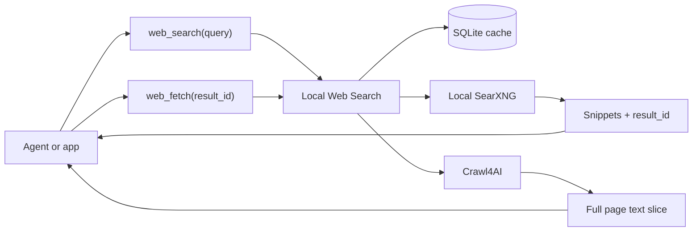

# Local Web Search

<p align="center">
  
</p>

<p align="center">
  <a href="https://github.com/maestromaximo/local-web-search/actions/workflows/ci.yml"></a>
  <a href="https://github.com/maestromaximo/local-web-search/actions/workflows/publish.yml"></a>
  <a href="https://pypi.org/project/local-web-search/"></a>
  <a href="https://pypi.org/project/local-web-search/"></a>
  <a href="https://github.com/maestromaximo/local-web-search/blob/main/LICENSE"></a>
  <a href="https://github.com/maestromaximo/local-web-search/stargazers"></a>
</p>

Local Web Search gives AI agents a local web-search backend with two familiar
tools:

- `web_search` asks your local SearXNG instance for search results and returns
  compact snippets.
- `web_fetch` uses Crawl4AI to fetch full page text only when the agent asks for
  a specific result.

## Quick Start: OpenAI Agents SDK

Install Local Web Search:

```powershell
pip install local-web-search
```

Then install the OpenAI Agents SDK yourself:

```powershell
pip install openai-agents
```

Or install both with the convenience extra:

```powershell
pip install "local-web-search[agents]"
```

> [!WARNING]
> Docker Engine must be running. With `build_container_if_missing=True`, Local
> Web Search starts the bundled SearXNG container automatically when it is
> missing or stopped.

Use the ready-made `web_search` and `web_fetch` tools in an agent:

```python
from agents import Agent, Runner
from local_agentic_search.agent_tools import build_agent_tools

web_search, web_fetch = build_agent_tools(build_container_if_missing=True)

agent = Agent(
    name="Research assistant",
    instructions=(
        "Use web_search for current web information. Search results are "
        "snippets. Call web_fetch with a result_id before relying on page "
        "details not present in a snippet."
    ),
    model="gpt-4.1-mini",
    tools=[web_search, web_fetch],
)

result = Runner.run_sync(agent, "Find recent information about Crawl4AI.")
print(result.final_output)
```

That is the main path: install the package, install the Agents SDK directly or
through the extra, keep Docker Engine running, and let `build_agent_tools()` do
the SearXNG startup.

## What It Does

Local Web Search keeps web discovery local. Your agent searches first, gets
small result snippets with stable `result_id` values, then fetches full page text
only for the result it actually needs. SQLite caching keeps result IDs and page
text stable across calls, so an agent can search, reason, fetch, and continue
without losing track of sources.



Why this shape works:

- Agents see normal tool names: `web_search` for discovery and `web_fetch` for
  source text.
- Search results stay compact, which keeps context windows cleaner.
- Full page fetches are deliberate, cached, and bounded by character limits.
- Execution happens in your local environment, pointed at your local SearXNG
  service.

## Install

Install the package:

```powershell
pip install local-web-search
```

Then point it at a SearXNG instance. If you cloned this repository, the bundled
Docker Compose setup can start one for you:

```powershell
docker compose up -d searxng
local-web-search doctor
```

If you already run SearXNG somewhere else, set `SEARXNG_BASE_URL` instead:

```powershell
$env:SEARXNG_BASE_URL = "http://127.0.0.1:8888"
local-web-search doctor
```

The Python import package is `local_agentic_search`:

```python
from local_agentic_search import LocalSearchService
```

## Optional Integrations

Most users do not need extras. The base package is enough for the CLI, direct
Python usage, and custom tool loops:

```powershell
pip install local-web-search
```

If you want the OpenAI Agents SDK path, you can either install the SDK manually:

```powershell
pip install local-web-search
pip install openai-agents
```

Or use the extra as a shortcut:

```powershell
pip install "local-web-search[agents]"
```

What each extra adds:

| Install | Adds | Use it when | Why it is normally not needed |
| --- | --- | --- | --- |
| `local-web-search` | CLI, Python service, SearXNG client, Crawl4AI fetch support | You want local search/fetch from the CLI or your own Python code | This is the normal path |
| `local-web-search[server]` | FastAPI and Uvicorn | You want `local-web-search serve` and HTTP routes | The CLI and direct Python imports do not need an HTTP server |
| `local-web-search[agents]` | OpenAI Agents SDK | You want ready-made `web_search` and `web_fetch` tools for an `Agent` | You can also install `openai-agents` yourself |
| `local-web-search[server,agents]` | Both integration layers | You want both the HTTP API and OpenAI Agents SDK helper tools | Most projects use one integration layer at a time |

The integrations are intentionally separate because the base package already
does the core job. The extras keep optional framework dependencies out of your
environment until you actually need them.

## Quick Start From This Repo

Clone the repository if you want the bundled Docker Compose SearXNG setup:

```powershell
git clone https://github.com/maestromaximo/local-web-search.git
cd local-web-search
docker compose up -d searxng
pip install -e ".[server,agents,dev]"
crawl4ai-setup
```

Check that SearXNG is reachable:

```powershell
local-web-search doctor
```

Search from the CLI:

```powershell
local-web-search search "OpenAI Agents SDK function tools" --max-results 5
```

Fetch full text for a result returned by search:

```powershell
local-web-search fetch res_... --max-chars 4000
```

Fetch a URL directly:

```powershell
local-web-search fetch https://example.com --max-chars 4000
```

Run the HTTP API:

```powershell
local-web-search serve --host 127.0.0.1 --port 8099
```

## CLI

```text
local-web-search doctor
local-web-search search "query" [--max-results 5] [--language en]
local-web-search fetch res_... [--start 0] [--max-chars 4000]
local-web-search fetch https://example.com [--max-chars 4000]
local-web-search serve [--host 127.0.0.1] [--port 8099]
```

Run `local-web-search --help` or `local-web-search <command> --help` for the
full command reference.

## OpenAI Agents SDK Usage

Install Local Web Search plus the OpenAI Agents SDK:

```powershell
pip install local-web-search
pip install openai-agents
```

Or use the convenience extra:

```powershell
pip install "local-web-search[agents]"
```

With Docker Engine running, build tools named `web_search` and `web_fetch`:

```python
from agents import Agent, Runner
from local_agentic_search.agent_tools import build_agent_tools

web_search, web_fetch = build_agent_tools(build_container_if_missing=True)

agent = Agent(
    name="Research assistant",
    instructions=(
        "Use web_search when current web information is useful. Search results "
        "are snippets. Call web_fetch with a result_id before relying on page "
        "details not present in a snippet."
    ),
    model="gpt-4.1-mini",
    tools=[web_search, web_fetch],
)

result = Runner.run_sync(agent, "Find recent information about Crawl4AI.")
print(result.final_output)
```

By default, `build_agent_tools()` assumes SearXNG is already running and prints
a yellow console warning once per process. To let the tool factory start SearXNG
when the container is missing or stopped:

```python
web_search, web_fetch = build_agent_tools(build_container_if_missing=True)
```

If port `8888` is already used on the host, choose another host port and keep
Docker plus the Python client aligned:

```python
web_search, web_fetch = build_agent_tools(
    build_container_if_missing=True,
    searxng_port=8899,
)
```

If the SearXNG container is already running on the old port, recreate it after
changing ports:

```powershell
docker compose down
$env:LOCAL_WEB_SEARCH_SEARXNG_PORT = "8899"
docker compose up -d searxng
```

To silence the warning while keeping startup manual:

```python
web_search, web_fetch = build_agent_tools(suppress_docker_warning=True)
```

## Responses API Tool Schemas

You do not need the `agents` extra for direct OpenAI API tool loops. Use the
schema helper:

```python
from local_agentic_search.tool_schemas import responses_tool_schemas

tools = responses_tool_schemas()
```

Your application still executes `web_search` and `web_fetch` locally and returns
their JSON outputs as function call outputs.

## HTTP API

Install the server integration only for this path:

```powershell
pip install "local-web-search[server]"
```

Start the server with:

```powershell
local-web-search serve
```

Routes:

- `GET /health`
- `GET /search?q=...&max_results=5`
- `POST /search`
- `POST /fetch`
- `GET /openai/tools`

See `examples/http_client_example.py` for a minimal async HTTP client.

## Examples

- `examples/agents_sdk_example.py`: build OpenAI Agents SDK tools named
  `web_search` and `web_fetch`.
- `examples/http_client_example.py`: call the local HTTP API with `httpx`.
- `examples/responses_schema_example.py`: print the Responses API tool schemas.

## Star Tracker

If Local Web Search saves you from wiring search tools by hand, starring the
repo helps track interest and keeps the project visible:

[](https://github.com/maestromaximo/local-web-search/stargazers)

## Search Result Shape

Each `web_search` result includes:

```json
{
  "result_id": "res_...",
  "search_id": "search_...",
  "position": 1,
  "title": "Page title",
  "url": "https://example.com",
  "snippet": "Compact SearXNG snippet",
  "site_links": [],
  "full_text_available": true,
  "full_text_command": {
    "tool": "web_fetch",
    "arguments": {
      "result_id": "res_...",
      "start": 0,
      "max_chars": 4000
    }
  },
  "full_text_command_text": "web_fetch(result_id='res_...', start=0, max_chars=4000)"
}
```

`web_fetch` returns a page slice with `start`, `end`, `total_chars`, `has_more`,
and a `next_fetch_command` when more text is available.

## Configuration

Environment variables:

- `SEARXNG_BASE_URL`: defaults to `http://127.0.0.1:8888`
- `LOCAL_WEB_SEARCH_CACHE`: defaults to `.cache/local_agentic_search.sqlite3`
- `LOCAL_WEB_SEARCH_RESULTS_TTL_SECONDS`: defaults to `86400`
- `LOCAL_WEB_SEARCH_PAGES_TTL_SECONDS`: defaults to `604800`
- `LOCAL_WEB_SEARCH_FETCH_CHARS`: default fetch slice size, defaults to `4000`
- `LOCAL_WEB_SEARCH_MAX_FETCH_CHARS`: maximum fetch slice size, defaults to
  `20000`
- `LOCAL_WEB_SEARCH_CRAWL_TIMEOUT_MS`: Crawl4AI timeout, defaults to `45000`
- `LOCAL_WEB_SEARCH_DOCKER_COMPOSE_FILE`: optional compose file path
- `LOCAL_WEB_SEARCH_DOCKER_CONTAINER`: optional SearXNG container name
- `LOCAL_WEB_SEARCH_SEARXNG_HOST`: host used by the Python client when
  `SEARXNG_BASE_URL` is unset, defaults to `127.0.0.1`
- `LOCAL_WEB_SEARCH_SEARXNG_PORT`: host port for the bundled SearXNG service,
  defaults to `8888`
- `LOCAL_WEB_SEARCH_SEARXNG_BIND`: Docker bind address for the bundled SearXNG
  service, defaults to `127.0.0.1`

The automatic Docker path uses a fast `docker container inspect` check. If the
configured container is paused, it runs `docker container unpause`; if it is
missing or stopped, it runs `docker compose up -d --build searxng`.

## License and Notices

Local Web Search is licensed under the Apache License 2.0.

SearXNG is a separate service licensed under the GNU Affero General Public
License v3.0 or later. Crawl4AI is licensed under the Apache License 2.0. See
`THIRD_PARTY_NOTICES.md` for details.

You are responsible for respecting robots.txt, website terms, copyright,
authentication boundaries, privacy rules, and rate limits when searching and
fetching public web content.
